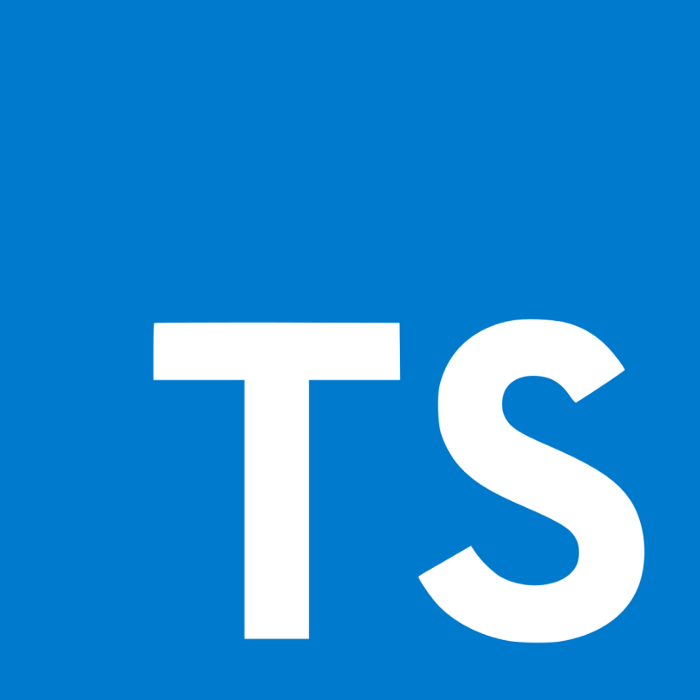

# 前言

## 简介

Vue R6 是 IBiSys 基于 Vue 新一代开源前端解决方案（以下简称解决方案），本文档将介绍该方案结构组成、开发模式等，为开发人员提供一定开发指导支持。
解决方案入门为中、高级难度，适合掌握 `FreeMarker`、`Vue`、`TypeScript` 等技术的开发人员。

  
  +
  
  +
  

## 特性

- 基于多版本企业级中后台产品迭代升级
- 使用 FreeMarker 模板引擎发布成果文件
- 集成 iVew、Element 等高质量 UI 组件， 
- 使用 TypeScript 中 tsx 、Less 构建成果文件，样式与逻辑分离。

## 支持环境

- 现代浏览器（不支持 IE ）。

## 支持 Vue 版本

目前支持 Vue `^2.6.10` 版本。

## 样式规范

主要使用 iVew、Element 等 UI 设计规范。

## 开发环境要求

- Node.js
- Yarn 
- Vue Cli 

## 链接

- [FreeMarker](https://freemarker.apache.org/)
- [Node.js](https://nodejs.org)
- [Yarn](https://yarnpkg.com)
- [Vue](https://vuejs.org/index.html)
- [Vue Cli](https://cli.vuejs.org/)
- [TypeScript](https://www.typescriptlang.org/)

