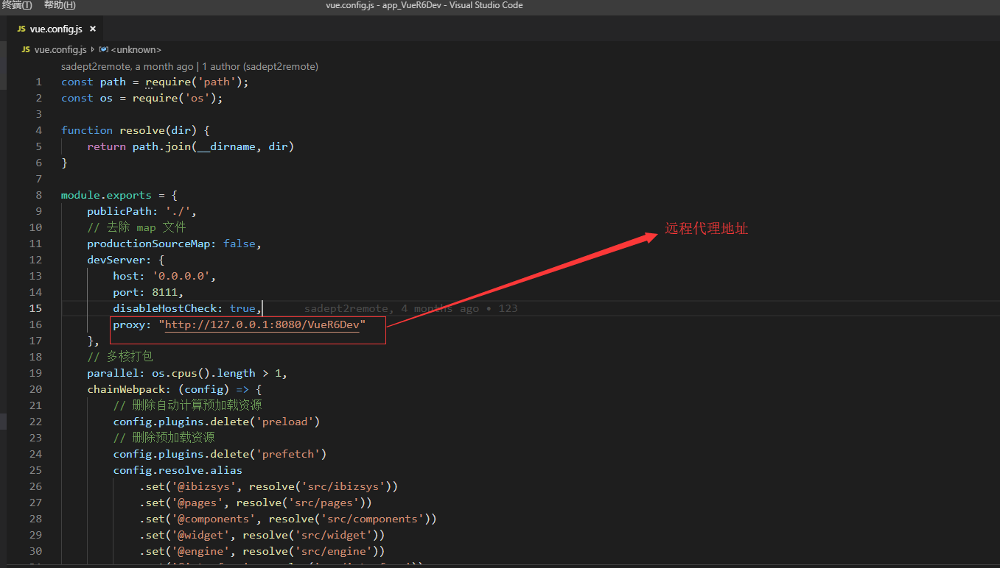

# 简介

快速上手，是解决方案成果本地运行的一系列步骤说明，开发人员在后端正常运行的情况下，运行前端的启动以及打包的过程，本部分内容直接操作解决方案成果，不需要 FreeMarker 语言和 iBiz 模型的支持。

此外，要求开发人员必须具备一定的前端开发基础知识，例如开发常规命令和 Vue 语法等。

<blockquote style="border-color: red;">
    <p>
        <strong>
            如果你刚开始学习前端，直接进入开发作为你的第一步可能不是最好的主意，掌握好基础知识再来吧！
        </strong>
    </p>
</blockquote>


# 步骤

## 准备开发环境

在安装使用 `Yarn` 和 `Vue Cli (3.0)` 前，务必确认 [Node.js](https://nodejs.org) 已经升级到 v4.8.0 或以上，强烈建议升级至最新版本。

> 如果你想了解更多 `Yarn` 工具链的功能和命令，建议访问 [Yarn](https://yarnpkg.com) 。
>
> 如果你想了解更多 `Vue Cli (3.0)` 工具链的功能和命令，建议访问 [Vue Cli (3.0)](https://cli.vuejs.org/) 。

安装顺序如下：

1. 访问 [Node.js](https://nodejs.org) ，根据文档安装 `Node.js`。
2. 访问 [Yarn](https://yarnpkg.com) ，根据文档安装 `Yarn`。
3. 访问 [Vue Cli (3.0)](https://cli.vuejs.org/) ，根据文档安装 `Vue Cli (3.0)`。

Windows 环境开发正常配置如下图：


##  安装依赖

打开前端项目，进入工作空间下，执行下列安装依赖命令：

```bash
$ yarn install
```

## 修改远程代理地址

修改配置文件  `vue.config.js`  内远程代理地址，如下图：



## 启动与访问

在工作空间下，执行下列启动命令：

```bash
$ yarn serve
```

启动后，通过 vue.config.js 开发服务 devServer 下配置的本地启动端口号访问开发项目，示例如下: 

```bash
$ http://localhost:8111
```

## 打包

在工作空间下，执行打包命令

```bash
$ yarn build
```

打包完成后，工作空间内有 dist 目录生成，该目录内内容为解决方案的最终交付产物。
