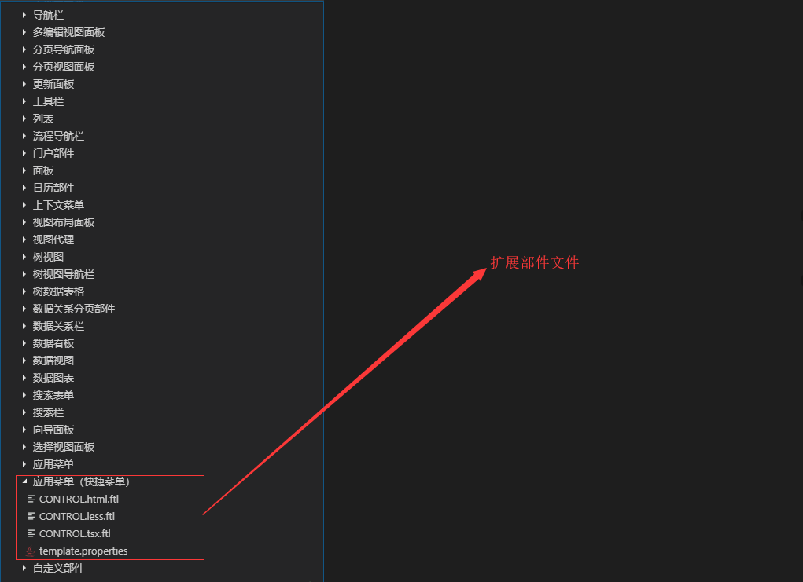
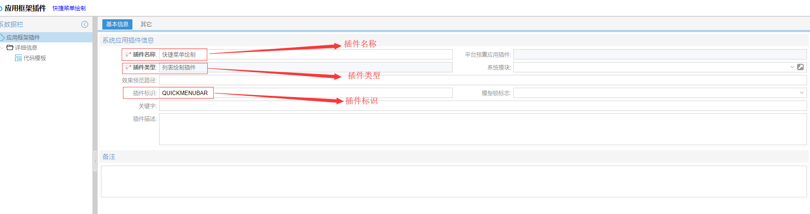
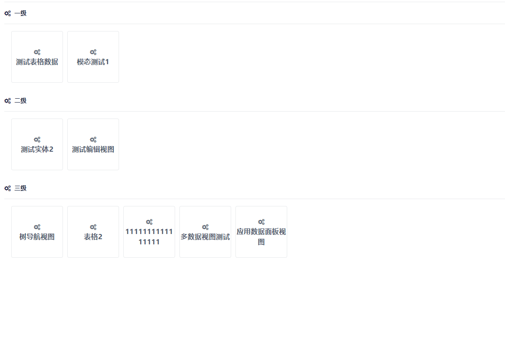

# 简介


在解决方案预置部件逻辑与部件内容不能满足业务需求时，就需求对部件进行扩展。


# 内容扩展

部件内容扩展，主要是扩展部件标签和部件绘制内容，在部件标签上绑定新的参数以及用新的内容替换原始内容。

<blockquote style="border-color: #2892ec;background-color: #f0faff;">
    <p>
        本部分使用应用快捷菜单部件（类别文件）作为说明对象，解释部件的内容扩展。
    </p>
</blockquote>

`render_block` 是部件内容扩展变量，用于绘制内容。

菜单发布内容如下：


```freemarker
<#if render_block??>
${render_block}
<#else>
    ---  默认内容区  ---
</#if>
```

内容扩展步骤如下：
- 新建部件模板文件
- 新建扩展部件标识
- 新建部件标签内容
- 新建部件绘制内容
- 新建系统应用插件
- 扩展后示例


## 新建部件模板文件

常规情况下，建立以下三个部分即可：
- 部件标签 CONTROL.html.ftl
- 部件样式 CONTROL.less.ftl
- 部件绘制内容 CONTROL.tsx.ftl
- 部件标识标识 template.properties

如下图所图：




## 新建扩展部件标识

IBizSys 模型预置菜单部件标识如下：

```freemarker
CTRLTYPE=APPMENU
```

`CTRLTYPE` 是部件类型，`APPMENU` 是部件标识名称，属于IBizSys 模型预置。

扩展部件标识内容：

```freemarker
CTRLTYPE=APPMENU#QUICKMENUBAR
```

`CTRLTYPE` 是部件类型，`APPMENU#QUICKMENUBAR` 是部件标识名称，其中 `QUICKMENUBAR` 属于用户自定义，在配置平台中使用。

部件级扩展标识，只需要在预置部件标识后添加 `#<部件名称>`，即可使用。


## 新建部件标签内容

菜单部件标签内容如下：

```freemarker
<#--  content  -->
<#assign content>
    showBusyIndicator={${ctrl.isShowBusyIndicator()?c}} 
    collapsechange={this.collapseChange} 
    mode={this.mode} 
    selectTheme={this.selectTheme} 
    isDefaultPage={this.isDefaultPage} 
    defPSAppView={this.defPSAppView}
</#assign>
<#ibizinclude>
../@MACRO/HTML/DEFAULT.html.ftl
</#ibizinclude>
```

`content` 默认标签 `DEFAULT.html.ftl` 定义属性变量，该变量将发布标签绑定属性参数。

属性说明如下：
- showBusyIndicator：是否显示加载状态
- collapsechange：菜单收缩变化
- mode：菜单模式（位置）
- selectTheme：主题
- isDefaultPage：是否默认页面
- defPSAppView：默认页面

`DEFAULT.html.ftl` 内容如下：

```freemarker
<#-- ctrl document  -->
<view_${ctrl.getName()} 
    viewState={this.viewState} 
    <#if content??>
    ${content} 
    </#if> 
    name='${ctrl.name}' 
    ref='${ctrl.name}' 
    <#if ctrl.getHookEventNames()??>
    <#list ctrl.getHookEventNames() as eventName>
    on-${eventName?lower_case}={($event: any) => this.${ctrl.name}_${eventName?lower_case}($event)} 
    </#list>
    </#if>
    on-closeview={($event: any) => this.closeView($event)}>
</view_${ctrl.getName()}>
```


快捷菜单扩展部件标签内容如下：

```freemarker
<#--  content  -->
<#assign content> 
    showBusyIndicator={${ctrl.isShowBusyIndicator()?c}} 
</#assign>
<#ibizinclude>
../@MACRO/HTML/DEFAULT.html.ftl
</#ibizinclude>
```

新的扩展取消了其他属性绑定，只保留 `showBusyIndicator` 是否显示加载状态属性


## 新建部件绘制内容


## 新建系统应用插件


如下图所示：



其中插件类型必须是对应插件类型，插件标识必须与扩展部件标识一致。


## 扩展后示例

快捷菜单扩展后，扩展内容如下图所示：




# 逻辑扩展

逻辑扩展包括内容看作之内，它是在模板文件直接修改内容，处理业务逻辑。

逻辑扩展之后，再次更新将不再同步文件，需要用户独立维护模板文件。