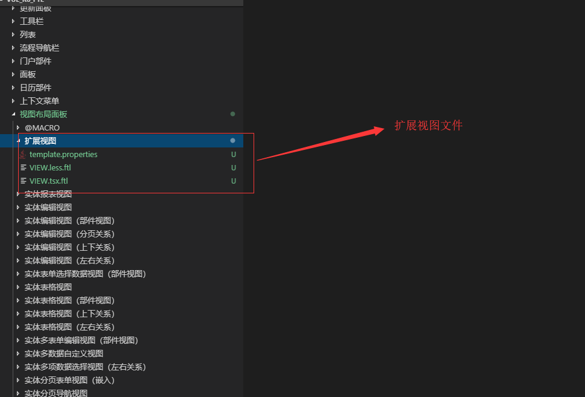

# 简介


视图模板文件，是 IBizSys R6 具备完全意义的表现与逻辑分离。


# 内容扩展

视图内容扩展，主要是扩展布局面板中视图绘制内容。

<blockquote style="border-color: #2892ec;background-color: #f0faff;">
    <p>
        本部分使用实体表格视图作为说明对象，解释视图的内容扩展。
    </p>
</blockquote>

内容扩展步骤如下：
- 新建扩展视图内容模板文件
- 新建扩展视图标识
- 新建扩展视图绘制内容
- 新建系统应用插件
- 扩展后示例


## 新建扩展视图内容模板文件

常规情况下，建立以下两个个部分即可：
- 部件绘制内容 LOGIC.tsx.ftl
- 部件标识标识 template.properties

如下图所图：




## 新建扩展视图标识


IBizSys 模型预置实体表格视图标识如下：

```freemarker
CTRLTYPE=VIEWLAYOUTPANEL#APPDEGRIDVIEW
```

`CTRLTYPE` 是部件类型，`VIEWLAYOUTPANEL#APPDEGRIDVIEW` 是实体表格视图布局样式标识名称，`VIEWLAYOUTPANEL` 、 `APPDEGRIDVIEW` 于IBizSys 模型预置。

`VIEWLAYOUTPANEL` 是布局面板标识，`APPDEGRIDVIEW` 是视图标识，二者一起，才是视图布局样式标识。

视图样式扩展标识命名模式有两种方式：
- 名称附加
- 名称替换

名称附加的扩展方式如下：

```freemarker
CTRLTYPE=VIEWLAYOUTPANEL#APPDEGRIDVIEW_pluginsfront
```

`CTRLTYPE` 是部件类型，`VIEWLAYOUTPANEL#APPDEGRIDVIEW` 是实体表格视图布局样式标识名称，`VIEWLAYOUTPANEL` 、 `APPDEGRIDVIEW` 于IBizSys 模型预置，`_pluginsfront` 属于附加的扩展标识名称，三者组成了完整的扩展标识名称。


名称替换的扩展方式如下：

```freemarker
CTRLTYPE=VIEWLAYOUTPANEL#pluginsfront
```

`CTRLTYPE` 是部件类型，`VIEWLAYOUTPANEL#pluginsfront` 是实体表格视图布局样式标识名称，`VIEWLAYOUTPANEL` 于IBizSys 模型预置，`_pluginsfront` 属于替换的扩展标识名称，二者组成了完整的扩展标识名称。


## 新建扩展视图绘制内容
## 新建系统应用插件
## 扩展后示例


# 逻辑扩展

