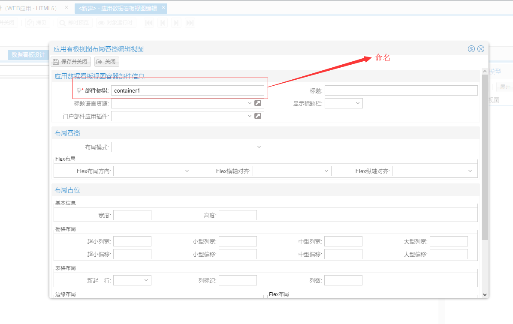

# 简介

`VUE_R6` 开发过程中，有部分问题需要开发人员规避，才能更好的解决开发问题。

# 数据看板内使用布局容器门户部件命名避免重复

在使用数据看板中，使用容器门户部件，名称不能重复。

使用实例如下图：

<blockquote style="border-color: red;">
    

        <strong>
            注：该命名是在整个前端应用中不可重复。
        </strong>
    

</blockquote>

