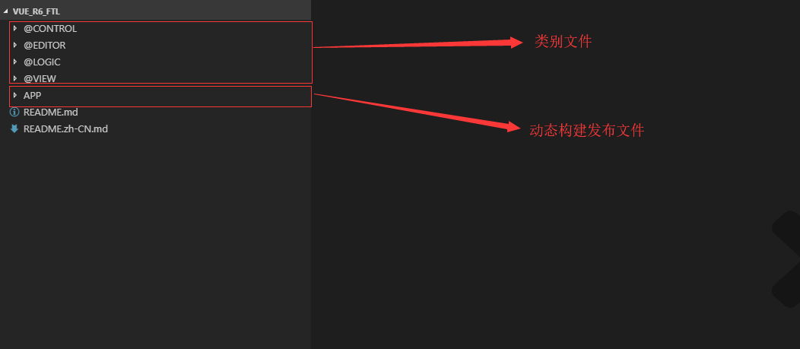

# 简介

<blockquote style="border-color: #2892ec;background-color: #f0faff;">
    

        <strong>注：该部分开发需要熟悉 FreeMarker </strong>
    

</blockquote>

模板文件是解决方案最核心的一部分，它解析业务模型数据，动态发布构建解决方案业务内容承载文件。

# 模板文件定义

模板文件定义了基础的文件类型，不同的类型文件可以动态发布业务逻辑内容。开发用户变更模板文件，即可批量处理解决方案业务文件，也可以根据业务需求自定义修改模式。

其中，模板文件主要分为两个部分：
> - 以 `@` 开始命名文件夹，类别定义。
> - 非 `@` 开始命名文件夹，动态解析业务模型，构建发布业务文件。

## 类别文件

类别文件是模板引擎的基本组成元素，主要分为下列几个部分：

- `@CONTROL` 部件（表单、表格等）
- `@EDITOR` 编辑器 （数据展现和处理的基本结构单元）
- `@LOGIC` 逻辑 （应用逻辑、界面行为、视图逻辑）
- `@VIEW` 视图 （各类视图）

## 动态构建业务文件

动态构建业务文件，是开发人员可以直观参与的处理的第一个入口节点。

它不包含 `FreeMarker` 代码，它是由业务模型解析发布生成的解决方案内容，主要由 `.tsx` 和 `.less` 两类文件。

开发人员可以在不经过模板文件的情况下，直接进入解决方案第一阶段内容处理业务逻辑，也能完成前端的业务开发要求。

# 结构

可变字段说明（均在 iBiz 平台进行配置）：

- ***<部件名称>***: iBiz 模型预置，如 `表格`、`表单` 等。
- ***<部件标识>***: iBiz 模型预置，如 `GRID`、`FORM` 等。
- ***<视图名称>***: iBiz 模型预置，如 `实体表格视图`、`实体编辑视图` 等。
- ***<编辑器名称>***: iBiz 模型预置，如 `文本框`、`密码框` 等。
- ***<应用功能名称>***: iBiz 模型预置，如 `打开应用视图`、`打开 THML 页面` 等。
- ***<界面行为名称>***: iBiz 模型预置，如 `前台调用`、`后台调用` 等。
- ***<系统预置界面行为名称>***: iBiz 模型预置，如 `保存`、`查看`、`删除` 等。
- ***<应用代码名称>***: 前端应用------代码名称。
- ***<应用模块代码名称>***: 前端应用------应用模块------代码名称。
- ***<实体代码名称>***: 数据模型------实体------代码名称。
- ***<视图代码名称>***: 前端应用------全部应用视图------视图------代码名称。
- ***<部件代码名称>***: 数据模型------实体------部件-------代码名称。

结构如下：

路径 | 说明 
------------ | ------------- 
VUE_R6_FTL | 模板文件项目名称
├── [@CONTROL](control.html) | 部件 （类别文件 - 不直接输出）
│...├── @MACRO | 宏文件
│...│...├── CONTROL | 逻辑与内容
│...│...│...├── CONTROL_BOTTOM.tsx.ftl | 部件内容尾部
│...│...│...├── CONTROL_HEADER.tsx.ftl | 部件内容头部
│...│...│...├── FORM_MEMBER_LAYOUT.tsx.ftl | 表单成员布局
│...│...│...├── LANGBASE.tsx.ftl | 语言资源
│...│...│...└── URL.tsx.ftl | url
│...│...├── CSS | 样式
│...│...│...└── DEFAULT.less.ftl | 默认样式
│...│...└── HTML | 标签
│...│...... ├── DEFAULT.html.ftl | 默认标签
│...│...... ├── DRTAB.html.ftl | 关系分页
│...│...... ├── FORM.html.ftl | 表单
│...│...... └── GRID.html.ftl | 表格
│...├── ***<部件名称>*** | 部件名称
│...│...├── CONTROL.html.ftl | 部件标签
│...│...├── CONTROL.less.ftl | 部件样式
│...│...├── CONTROL.tsx#COLUMN.ftl | 部件成员
│...│...├── CONTROL.tsx.ftl | 部件逻辑与内容
│...│...└── template.properties | 部件标识
│...└── 视图布局面板 | 视图布局面板
│...... ├── @MACRO | 宏文件
│...... │...├── DEFAULT.less.ftl | 默认视图样式
│...... │...├── DEFAULT.tsx.ftl | 默认视图绘制（render）内容
│...... │...├── EDIT.tsx.ftl | 编辑视图内容
│...... │...├── EDIT3.tsx.ftl | 分页编辑视图内容
│...... │...├── GRID.tsx.ftl | 表格视图内容
│...... │...├── LIST.tsx.ftl | 列表视图内容
│...... │...├── VIEW_CAPTION.tsx.ftl | 视图标题
│...... │...├── VIEW_CAPTION_DATAINFO.tsx.ftl | 视图标题和信息
│...... │...├── VIEW_MD_CONTENT.tsx.ftl | 多数据视图内容区
│...... │...└── WIZARD.tsx.ftl | 向导视图内容
│...... ├── ***<视图名称>*** | 视图名称
│...... │...├── template.properties | 视图标识
│...... │...├── VIEW.less.ftl | 视图样式
│...... │...└── VIEW.tsx.ftl | 视图绘制（render）内容
├── [@EDITOR](editor.html) | 编辑器 （类别文件 - 不直接输出）
│...├── @MACRO | 宏文件 
│...│...├── GRID | 行编辑编辑器
│...│...│...└── DEFAULT.tsx.ftl | 默认编辑器
│...│...└── PANEL | 面板编辑器
│...│...... └── DEFAULT.tsx.ftl | 默认编辑器
│...└── ***<编辑器名称>*** | 编辑器名称
│...... ├── EDITOR.less.ftl | 编辑器样式
│...... ├── EDITOR.tsx.ftl | 编辑器内容
│...... ├── GRIDEIDTOR.tsx.ftl | 行编辑内容
│...... ├── PANELEDITOR.tsx.ftl | 面板编辑内容
│...... └── template.properties | 编辑器标识
├── [@LOGIC](logic.html) | 逻辑 （类别文件 - 不直接输出）
│...├── @APPFUNC | 应用功能
│...│...├── ***<应用功能名称>*** | 应用功能名称
│...│...│...├── LOGIC.tsx.ftl |  应用功能逻辑
│...│...│...└── template.properties | 应用功能标识
│...├── @UIACTION | 界面行为
│...│...├── ***<界面行为名称>*** | 界面行为名称
│...│...│...├── LOGIC.tsx.ftl | 界面行为逻辑
│...│...│...└── template.properties | 界面行为标识
│...│...└── 系统预置 | 系统预置
│...│...... ├── sys | 系统预置
│...│...... │...└── ***<系统预置界面行为名称>*** | 系统预置界面行为名称
│...│...... │...... ├── LOGIC.tsx.ftl | 预置界面行为逻辑
│...│...... │...... └── template.properties | 预置界面行为逻辑标识
│...│...... ├── LOGIC.tsx.ftl | 
│...│...... └── template.properties | 
│...└── @VIEWLOGIC | 视图逻辑
│...... ├── 新建 | 新建逻辑
│...... │...├── LOGIC.tsx.ftl | 新建内容
│...... │...└── template.properties | 新建标识
│...... ├── 编辑 | 编辑逻辑
│...... │...├── LOGIC.tsx.ftl | 编辑内容
│...... │...└── template.properties | 编辑标识
│...... └── 部件事件 | 部件事件
│.........  ├── LOGIC.tsx.ftl | 事件逻辑
│.........  └── template.properties | 事件标识
├── [@VIEW](view.html) | 视图 （类别文件 - 不直接输出）
│...├── @MACRO | 宏文件 （视图逻辑）
│...│...├── DATAVIEW_VIEW.tsx.ftl | 数据视图
│...│...├── EDIT_VIEW3.tsx.ftl | 分页编辑视图
│...│...├── EMBED_VIEW.tsx.ftl | 嵌入视图
│...│...├── GRID_VIEW.tsx.ftl | 表格视图
│...│...├── LAYOUTPANEL_VIEW.tsx.ftl | 视图内容绘制方法
│...│...├── PICKUPGRID_VIEW.tsx.ftl | 选择表格视图
│...│...├── VIEW.tsx.ftl | 默认视图
│...│...├── VIEW_BOTTOM.tsx.ftl | 视图逻辑尾部
│...│...├── VIEW_CONTENT.tsx.ftl | 视图逻辑内容
│...│...├── VIEW_HEADER.tsx.ftl | 视图逻辑头部
│...│...└── VIEW_MODEL.tsx.ftl | 视图模型
│...└── ***<视图名称>*** | 视图名称
│...... ├── template.properties | 视图标识
│...... ├── VIEW.less.ftl | 视图样式
│...... └── VIEW.tsx.ftl | 视图逻辑
├── APP | 业务模型内容（业务模型-发布业务文件）
│...├── public | 公共目录
│...│...└── assets | 业务模型静态资源
│...│...... └── sampledata | 实例数据
│...│.........  └── ***<应用代码名称>*** | 应用代码名称
│...│...............├── ***<应用代码名称>*** |  应用代码名称
│...│...............├── app | 应用数据
│...│...............└── ctrl | 个别部件数据
│...├── src | 核心资源
│...│...├── environments | 资源文件
│...│...│...└── environment.ts.ftl | 资源
│...│...├── locale | 语言资源
│...│...│...├── @MACRO | 宏文件 
│...│...│...│...├── CAPTIONLANG.tsx | 标题语言资源
│...│...│...│...└── TIPLANG.tsx | 提示语言资源
│...│...│...├── lang | 预置语言资源
│...│...│...│...├── en-US.ts.ftl | 英文
│...│...│...│...└── zh-CN.ts.ftl | 中文
│...│...│...├── lanres | 引用语言资源
│...│...│...│...└── ***<实体代码名称>*** | 实体代码名称
│...│...│...│...... ├── ***<实体代码名称>***_en_US.ts.ftl | 英文语言资源
│...│...│...│...... └── ***<实体代码名称>***_zh_CN.ts.ftl | 中文语言资源
│...│...│...├── index.ts.ftl | 语言资源导出文件
│...│...│...└── local-list.ts.ftl | 语言资源列表
│...│...├── pages | 视图
│...│...│...└── ***<应用模块代码名称>*** | 应用模块代码名称
│...│...│...... └── ***<视图代码名称>*** | 视图代码名称
│...│...│.........  ├── ***<视图代码名称>***.less.ftl | 视图样式文件
│...│...│.........  └── ***<视图代码名称>***.tsx.ftl | 视图（逻辑与内容）
│...│...├── store | 状态管理
│...│...│...└── modules | 模块
│...│...│...... └── view-action | 视图状态模块
│...│...│.........  └── state.ts.ftl | 
│...│...├── widget | 部件
│...│...│...├── ***<实体代码名称>*** | 实体代码名称
│...│...│...│...└── ***<部件代码名称>***-***<部件标识>*** | 部件代码名称-部件标识
│...│...│...│...... ├── ***<部件代码名称>***-***<部件标识>***.less.ftl | 部件样式
│...│...│...│...... └── ***<部件代码名称>***-***<部件标识>***.tsx.ftl | 部件（逻辑与内容）
│...│...│...└── app | 应用
│...│...│...... └── ***<部件代码名称>***-***<部件标识>*** | 部件（应用部件）
│...│...│.........  ├── ***<部件代码名称>***-***<部件标识>***.less.ftl | 部件样式
│...│...│.........  └── ***<部件代码名称>***-***<部件标识>***.tsx.ftl | 部件（逻辑与内容）
│...│...├── page-register.ts.ftl | 视图注册（动态注册应用视图）
│...│...└── router.ts.ftl | 路由（动态发布应用路由数据）
│...└── vue.config.js.ftl | vue cli 配置文件（远程代理地址）
├── README.md | 说明文档
└── README.zh-CN.md | 说明文档（中文版）

