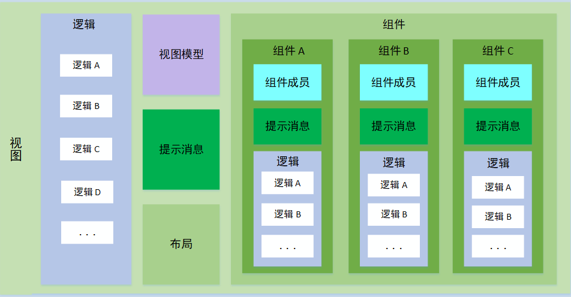

# 简介


视图是业务模型内容的最大承载节点，它包含了部件、逻辑等。

其中，视图内容逻辑在模板结构中是分离的。

<blockquote style="border-color: #2892ec;background-color: #f0faff;">
    <p>
        <strong>
        本部分使用实体表格视图（类别文件）作为说明对象，解释视图的构成单位以及构成内容。
        </strong>
    </p>
</blockquote>


# 构成单位

表格视图视图的基本构成单位：
- 视图（逻辑与内容） VIEW.tsx.ftl
- 视图样式 VIEW.less.ftl
- 视图标识 template.properties


## 视图（逻辑与内容）


### 视图逻辑

视图逻辑则是独立的目录维护，表格视图 VIEW.tsx.ftl 代码如下：

```freemarker
<#ibizinclude>
../@MACRO/GRID_VIEW.tsx.ftl
</#ibizinclude>
```

`GRID_VIEW.tsx.ftl` 宏文件内容如下：
```freemarker
<#ibizinclude>
./VIEW_HEADER.tsx.ftl
</#ibizinclude>

<#ibizinclude>
./VIEW_CONTENT.tsx.ftl
</#ibizinclude>
<#assign grid></#assign>
<#if view.hasPSControl('grid')>
<#assign grid = view.getPSControl('grid')>
</#if>
<#if grid??>

    /**
     * 是否单选
     *
     * @type {boolean}
     * @memberof ${srfclassname('${view.name}')}
     */
    public isSingleSelect: boolean = ${grid.isSingleSelect()?c};
</#if>

    /**
     * 搜索值
     *
     * @type {string}
     * @memberof ${srfclassname('${view.name}')}
     */
    public query: string = '';

    /**
     * 是否展开搜索表单
     *
     * @type {boolean}
     * @memberof ${srfclassname('${view.name}')}
     */
    public isExpandSearchForm: boolean = ${view.isExpandSearchForm()?c};

    /**
     * 表格行数据默认激活模式
     * 0 不激活
     * 1 单击激活
     * 2 双击激活
     *
     * @type {(number | 0 | 1 | 2)}
     * @memberof ${srfclassname('${view.name}')}
     */
    public gridRowActiveMode: number | 0 | 1 | 2 = ${view.getGridRowActiveMode()?c};

    /**
     * 快速搜索
     *
     * @param {*} $event
     * @memberof ${srfclassname('${view.name}')}
     */
    public onSearch($event: any): void {
        <#if grid??>
        const grid: any = this.$refs.${grid.name};
        if (grid) {
            grid.load({});
        }
        </#if>
    }
<#if grid??>

    /**
     * 刷新数据
     *
     * @readonly
     * @type {(number | null)}
     * @memberof ${srfclassname('${view.name}')}
     */
    get refreshdata(): number | null {
        return this.$store.getters['viewaction/getRefreshData'](this.viewtag);
    }

    /**
     * 监控数据变化
     *
     * @param {*} newVal
     * @param {*} oldVal
     * @returns
     * @memberof ${srfclassname('${view.name}')}
     */
    @Watch('refreshdata')
    onRefreshData(newVal: any, oldVal: any) {
        if (newVal === null || newVal === undefined) {
            return;
        }
        if (newVal === 0) {
            return;
        }
        const grid: any = this.$refs.${grid.name};
        if (grid) {
            grid.load({});
        }
    }
</#if>

<#ibizinclude>
./LAYOUTPANEL_VIEW.tsx.ftl
</#ibizinclude>

<#ibizinclude>
./VIEW_BOTTOM.tsx.ftl
</#ibizinclude>
```

其中 `LAYOUTPANEL_VIEW.tsx.ftl` 主要用于输出视图内容。


### 视图内容

视图内容主要在部件的视图布局面板中，该面板包含所有的视图布局。

`LAYOUTPANEL_VIEW.tsx.ftl` 输出视图内容，代码如下：
```freemarker
<#--  视图内容绘制  -->
<#if view.getPSViewMsgGroup()??>
<#assign viewMsgGroup = view.getPSViewMsgGroup()/>

    /**
     * 绘制视图消息 （上方）
     *
     * @returns
     * @memberof ${srfclassname('${view.name}')}
     */
    public renderPosTopMsgs() {
        return (
            <div class='view-top-messages'>
                <#list viewMsgGroup.getPSViewMsgGroupDetails() as detail>
                <#assign msg = detail.getPSViewMsg()>
                <#--  暂时支持静态  -->
                <#if msg.getCodeName() != '' && msg.getPosition() == 'TOP' && msg.getDynamicMode() == 0>
                {this.render${msg.getCodeName()}()}
                </#if>
                </#list>
            </div>
        );
    }

    /**
     * 绘制视图消息 （下方）
     *
     * @returns
     * @memberof ${srfclassname('${view.name}')}
     */
    public renderPosBottomMsgs() {
        return (
            <div class='view-bottom-messages'>
                <#list viewMsgGroup.getPSViewMsgGroupDetails() as detail>
                <#assign msg = detail.getPSViewMsg()>
                <#--  暂时支持静态  -->
                <#if msg.getCodeName() != '' && msg.getPosition() == 'BOTTOM' && msg.getDynamicMode() == 0>
                {this.render${msg.getCodeName()}()}
                </#if>
                </#list>
            </div>
        );
    }

<#list viewMsgGroup.getPSViewMsgGroupDetails() as detail>
<#assign msg = detail.getPSViewMsg()>
<#--  暂时支持静态  -->
<#if msg.getCodeName() != '' && msg.getDynamicMode() == 0>
<#assign type = msg.getMessageType() />

    /**
     * ${msg.getName()}
     *
     * @returns
     * @memberof ${srfclassname('${view.name}')}
     */
    public render${msg.getCodeName()}() {
        return (
            <alert type='<#if type == 'INFO'>info<#elseif type == 'WARN'>warning<#elseif type == 'ERROR'>error<#else>info</#if>' closable={${msg.isEnableRemove()?c}}>
                ${msg.getTitle()}
                <span slot='desc'>${msg.getMessage()}</span>
            </alert>
        );
    }
</#if>
</#list>
<#else>

    /**
     * 绘制视图消息 （上方）
     *
     * @returns
     * @memberof ${srfclassname('${view.name}')}
     */
    public renderPosTopMsgs() {
        return (
            <div class='view-top-messages'>
            </div>
        );
    }

    /**
     * 绘制视图消息 （下方）
     *
     * @returns
     * @memberof ${srfclassname('${view.name}')}
     */
    public renderPosBottomMsgs() {
        return (
            <div class='view-bottom-messages'>
            </div>
        );
    }
</#if>
    
    /**
     * 绘制内容
     *
     * @param {CreateElement} h
     * @returns
     * @memberof ${srfclassname('${view.name}')}
     */
    public render(h: CreateElement) {
        return (
<@ibizindent blank=8>
${P.getLayoutCode().code}
</@ibizindent>
        );
    }
```

该部分包括视图消息与绘制内容，此处主要介绍绘制内容，以实体表格视图为例。


视图内容成员主要包括：
- 视图绘制内容 template.properties
- 视图绘制样式 VIEW.less.ftl
- 视图绘制标识 VIEW.tsx.ftl


#### 视图绘制内容

表格视图绘制内容如下：
```freemarker
<#ibizinclude>
../@MACRO/GRID.tsx.ftl
</#ibizinclude>
```

`GRID.tsx.ftl` 宏文件内容：
```freemarker
<div class='view-container ${srffilepath2(view.getCodeName())}<#if view.getPSSysCss?? && view.getPSSysCss()??> ${view.getPSSysCss().getCssName()}</#if>'>
    <card class='view-card<#if !view.isShowCaptionBar()> view-no-caption</#if>'  dis-hover={true} bordered={false}>

    <#ibizinclude>
    ./VIEW_CAPTION.tsx.ftl
    </#ibizinclude>


        <div class='content-container'>
            {this.renderPosTopMsgs()}
<#assign MDContent>
<#comment><!--开始：快速搜索或工具栏存在--></#comment>
<#if (view.isEnableQuickSearch() || view.hasPSControl('toolbar'))>
<row style='margin-bottom: 6px;'>
    <#if view.isEnableQuickSearch()>
    <i-input<#if view.hasPSControl('searchform')><#if view.isExpandSearchForm??> v-show={!this.isExpandSearchForm}</#if></#if> v-model={this.query} search enter-button on-on-search={($event: any) => this.onSearch($event)} class='pull-left' style='max-width: 400px;margin-top:6px;' />
    </#if>
    <div class='pull-right'>
<@ibizindent blank=8>
<#if view.hasPSControl('toolbar')>
${P.getCtrlCode('toolbar', 'CONTROL.html').code}
</#if>
</@ibizindent>
    </div>
</row>
</#if>
<#comment><!--结束：快速搜索或工具栏存在--></#comment>
<#if view.hasPSControl('searchform')>
${P.getCtrlCode('searchform', 'CONTROL.html').code}
</#if>
<#if view.hasPSControl('grid')>
${P.getCtrlCode('grid', 'CONTROL.html').code}
</#if>
</#assign>

<#ibizinclude>
./VIEW_MD_CONTENT.tsx.ftl
</#ibizinclude>
            {this.renderPosBottomMsgs()}
        </div>
    </card>
</div>
```


#### 视图绘制样式

视图绘制样式丰富了的视图内容组成。


#### 视图绘制标识

```freemarker
CTRLTYPE=VIEWLAYOUTPANEL#APPDEGRIDVIEW
```

`CTRLTYPE` 是部件类型，`VIEWLAYOUTPANEL#APPDEGRIDVIEW` 是视图布局面板标识名称和视图标识名称，属于 IBizSys 模型预置。


## 视图样式

视图样式输出过程如下：

DEFAULT.less.ftl --------> 布局面板实体表格视图样式 --------> 实体表格视图样式

输出实体表格视图样式 `FreeMarker` 代码，它指向布局面板实体表格视图样式。
```freemarker
${P.getLayoutCode().code}
```

布局面板实体表格视图样式，引入了宏文件，视图样式扩展，目标是替换该文件。
```freemarker
<#ibizinclude>
../@MACRO/DEFAULT.less.ftl
</#ibizinclude>
```

DEFAULT.less.ftl 宏文件内容。
```freemarker
// this is less

<#if view.hasPSControl('toolbar')>
<@ibizindent blank=8>
${P.getCtrlCode('toolbar', 'CONTROL.less').code}
</@ibizindent>
</#if>

<#assign viewCssName = '' />
<#if view.getPSSysCss()??>
<#assign viewCssName = view.getPSSysCss().getCssName()>
</#if>
<#list view.getPSSysCsses() as syscss>
<#if syscss.getCssStyle()??>
<#if syscss.getCssName() != viewCssName>
<#if syscss.getRawCssStyle()?? && syscss.getRawCssStyle()?length gt 0>
.${syscss.getCssName() } {
    ${syscss.getRawCssStyle()}
}
</#if>
<#if syscss.getCssStyle()??>
${syscss.getCssStyle()}
</#if>
</#if>
</#if>
</#list>

<#if view.getPSSysCss()??>
<#assign css=view.getPSSysCss()/>
<#if css.getRawCssStyle()?? && css.getRawCssStyle()?length gt 0>
.${css.getCssName()} {
    ${css.getRawCssStyle()}
}
</#if>
<#if css.getCssStyle()??>
${css.getCssStyle()}
</#if>
</#if>
```


## 视图标识

```freemarker
VIEWTYPE=APPDEGRIDVIEW
```

`VIEWTYPE` 是视图类型，`APPDEGRIDVIEW` 是视图标识名称，属于 IBizSys 模型预置。

# 构成内容

应用视图结构如下：

